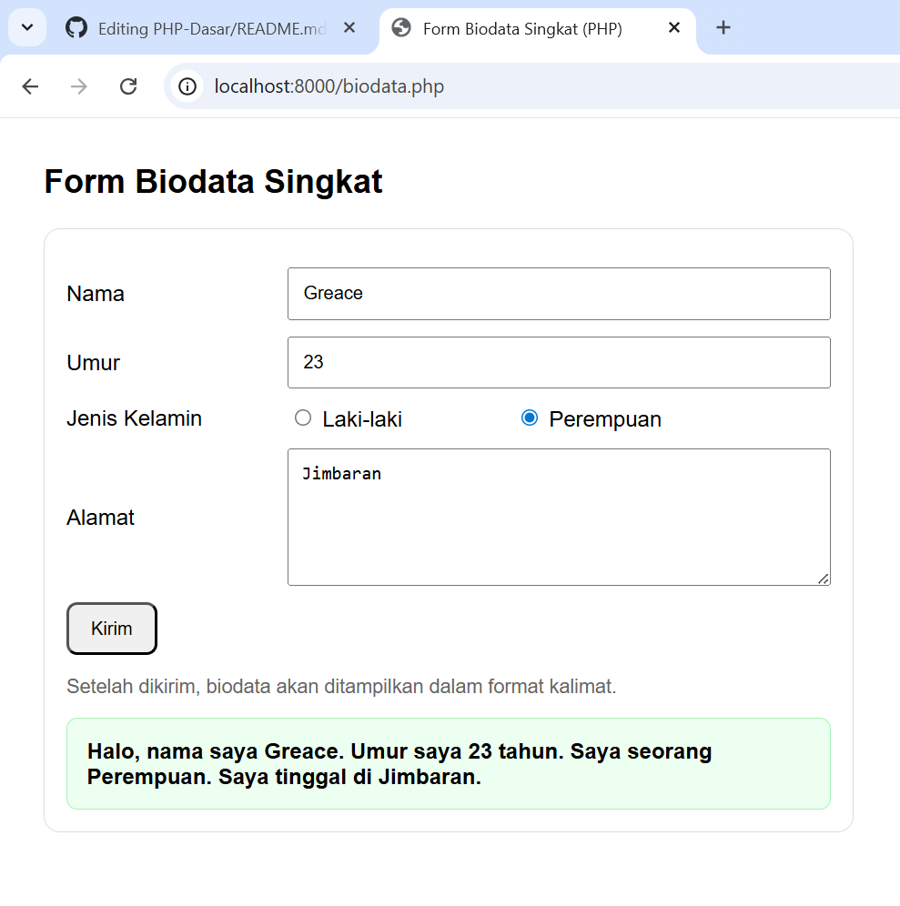
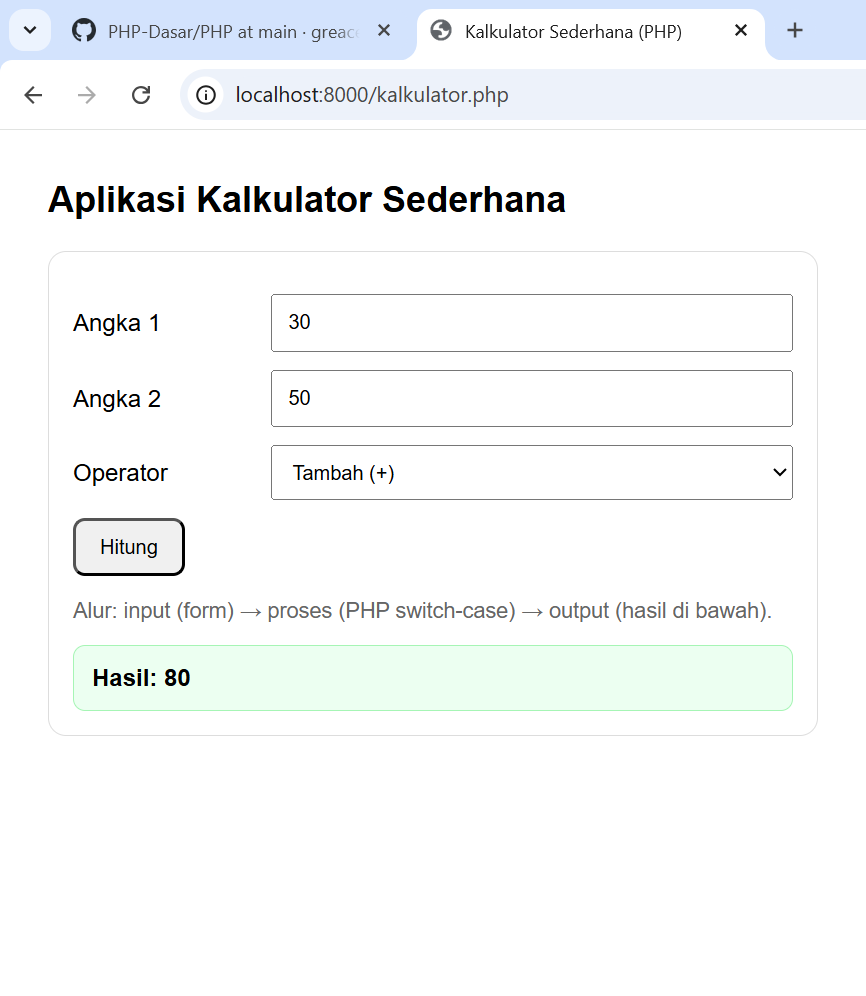

# PHP Dasar

Repository ini berisi beberapa contoh aplikasi sederhana menggunakan **PHP Dasar**.  
Setiap aplikasi dilengkapi dengan hasil screenshot agar lebih mudah dipahami.

---

## 📌 Daftar Aplikasi

### 1. Biodata
File: `biodata.php`  
Menampilkan data diri dengan format sederhana.

---

### 2. Form Ucapan
File: `form-ucapan.php`  
Aplikasi sederhana untuk menampilkan ucapan berdasarkan input pengguna.

---

### 3. Ganjil Genap
File: `ganjil-genap.php`  
Menentukan apakah angka yang dimasukkan **ganjil** atau **genap**.

---

### 4. Kalkulator
File: `kalkulator.php`  
Kalkulator sederhana untuk melakukan operasi matematika dasar.

---

### 5. Menu Makanan
File: `menu-makanan.php`  
Menampilkan harga dari menu makanan sederhana.

---

### 6. Nilai Huruf
File: `nilai-huruf.php`  
Mengonversi nilai angka menjadi nilai huruf.

